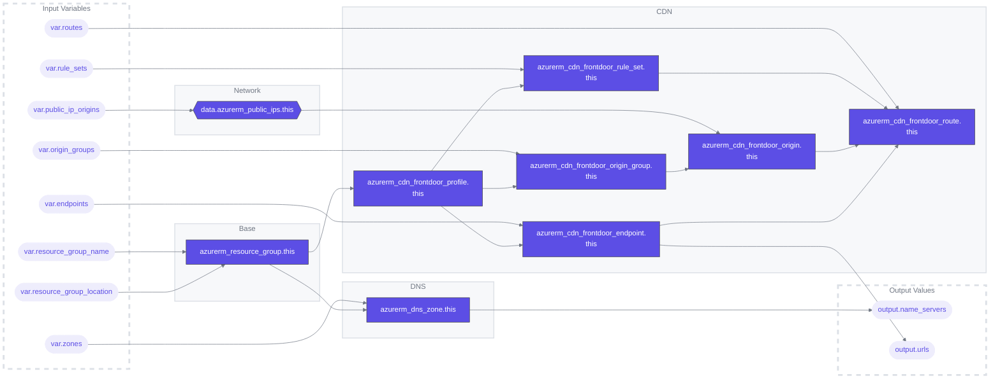

# Fronthub Terraform Module

## Overview
This Terraform configuration automates the setup of Azure CDN resources, streamlining the deployment and management of CDN infrastructure.

### Terraform Architecture

## Features
- **Resource Group Management**: Creates and manages Azure resource groups.
- **DNS Zone Configuration**: Handles the setup and configuration of Azure DNS zones.
- **CDN Frontdoor Profiles**: Sets up Azure CDN frontdoor profiles for content delivery optimization.
- **Dynamic Origin Groups**: Supports dynamic creation of origin groups based on input variables.
- **Public IP Integration**: Configures public IPs for CDN origins.
- **CDN Endpoints**: Manages the creation and configuration of CDN endpoints.
- **Routing Rules**: Implements routing rules for efficient content delivery.
- **Automatic Output Generation**: Outputs important details like name servers and endpoint URLs.

## File Structure
- [01-providers.tf](./01-providers.tf): Defines Terraform and AzureRM provider requirements.
- [outputs.tf](./outputs.tf): Contains outputs like name servers and URLs for CDN endpoints.
- [variables.tf](./variables.tf): Specifies required variables for the configuration.

## Usage
For usage examples, refer to the [`example`](./example) directory.

## Workflows
| Name | Description |
|---|---|
| [terraform-ci.yaml](.github/workflows/terraform-ci.yaml) | A workflow for linting and auto-formatting Terraform code. Triggered by pushes to  `main` and `dev` branches or on pull requests, it consists of two jobs: `tflint` for lint checks, `format` for code formatting and submit a PR, and `tfmermaid` to update architecture graph and submit a PR. |
